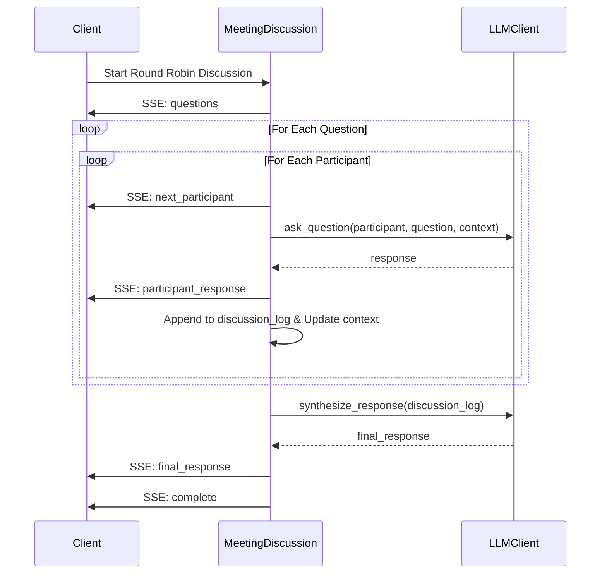
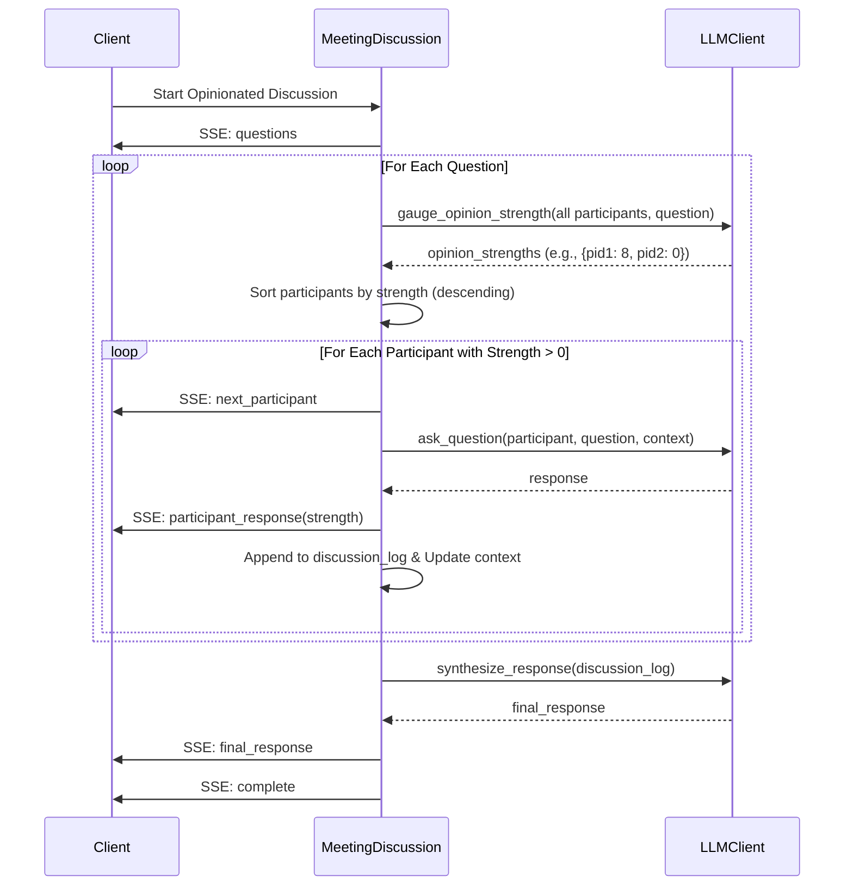

# Roundtable AI

[](https://opensource.org/licenses/MIT) <!-- Assuming MIT License based on common practice -->

Roundtable AI is a multi-agent system designed for orchestrating structured discussions among AI participants. It features a high-performance FastAPI backend and a modern React frontend, enabling real-time collaboration and interaction facilitated by Large Language Models (LLMs).

## Overview

The core purpose of Roundtable AI is to simulate and manage group discussions where AI agents (participants) interact based on predefined topics and strategies. Users can create participants, group them, initiate meetings, and observe the AI-driven conversations unfold in real-time. The system leverages LLMs for generating discussion content, managing conversation flow, and synthesizing outcomes.

## Key Features

*   **Participant Management:** Create, view, update, and delete AI participants with specific personas or instructions.
*   **Group Management:** Organize participants into groups for focused discussion sessions.
*   **Meeting Orchestration:** Initiate and manage meeting sessions linked to specific groups and topics.
*   **Real-time Chat:** Observe live, streaming discussions between participants within a meeting via Server-Sent Events (SSE).
*   **LLM Integration:** Utilizes LLMs (configurable, e.g., Azure OpenAI) to:
    *   Generate participant responses based on context and persona.
    *   Suggest relevant discussion questions based on a topic.
    *   Facilitate different discussion strategies.
*   **Discussion Strategies:** Implements distinct methods for managing turn-taking and participation:
    *   **Round Robin:** Ensures equal participation, cycling through participants for each question.
    *   **Opinionated:** Prioritizes participants based on the LLM-gauged strength of their opinion on a topic.
*   **Chat Context Management:** Uses ChromaDB to store and retrieve chat history for maintaining context during discussions.
*   **User Authentication:** Frontend includes protected routes and login functionality (details in `frontend/AUTH0_SETUP.md`).
*   **Configurable LLM Providers:** Manage and select different LLM API credentials.

## Architecture

The application follows a client-server architecture:

*   **Backend:** A Python-based API built with **FastAPI**, handling business logic, data persistence, LLM interactions, and real-time event streaming.
*   **Frontend:** A **React** single-page application built with **Vite** and **TypeScript**, providing the user interface for managing entities and viewing discussions. It uses **Tailwind CSS** and **shadcn/ui** for styling.

## Technology Stack

**Backend:**
*   Framework: FastAPI
*   Language: Python 3.9+
*   Database: SQLite (for core entities), ChromaDB (for chat context)
*   LLM Integration: `openai` library (configured for Azure OpenAI)
*   API Schema: Pydantic
*   Server: Uvicorn
*   Dependencies: `requirements.txt`

**Frontend:**
*   Framework: React 18+
*   Language: TypeScript
*   Build Tool: Vite
*   Styling: Tailwind CSS v4 (alpha), shadcn/ui
*   State Management: React Context API
*   Routing: `react-router-dom`
*   API Client: `axios` (via `src/lib/api.ts`)
*   Dependencies: `package.json`

## Getting Started

### Prerequisites

*   Python 3.9+ and `pip`
*   Node.js (LTS version recommended) and `npm`
*   Git
*   Access to an OpenAI (or compatible, like Azure OpenAI) API key.

### Installation & Setup

1.  **Clone the repository:**
    ```bash
    git clone https://github.com/hybridtechie/roundtable-ai.git
    cd roundtable-ai
    ```

2.  **Backend Setup:**
    ```bash
    cd backend
    # Create a virtual environment (optional but recommended)
    # python -m venv venv
    # source venv/bin/activate  # On Windows use `venv\Scripts\activate`
    pip install -r requirements.txt
    # Create a .env file based on .env.example (if provided) or set environment variables:
    # Example required variables:
    # AZURE_OPENAI_API_KEY="your_api_key"
    # AZURE_OPENAI_ENDPOINT="your_endpoint"
    # AZURE_OPENAI_DEPLOYMENT_NAME="your_deployment_name"
    # Add other necessary variables (DB paths, etc.)
    cd ..
    ```

3.  **Frontend Setup:**
    ```bash
    cd frontend
    npm install
    # Configure Auth0 or other auth providers if needed (see frontend/AUTH0_SETUP.md)
    # Ensure VITE_API_BASE_URL in .env (if used) points to the backend (default: http://localhost:8000)
    cd ..
    ```

### Running the Application

1.  **Start the Backend Server:**
    ```bash
    cd backend
    uvicorn main:app --host 0.0.0.0 --port 8000 --reload
    # Keep this terminal running
    ```

2.  **Start the Frontend Development Server:**
    ```bash
    cd frontend
    npm run dev
    # Keep this terminal running
    ```

3.  **Access the Application:**
    Open your browser and navigate to `http://localhost:5173` (or the port specified by Vite).

## Discussion Strategies Explained

This section details the `Round Robin` and `Opinionated` discussion strategies managed by the backend.

### Round Robin Strategy

*   **Overview:** Ensures every participant gets an equal opportunity to respond to each question sequentially. Context from previous answers informs subsequent responses.
*   **Flow:** Cycles through participants for question 1, then cycles again for question 2, etc.
*   **Use Case:** Structured, inclusive discussions where all viewpoints are needed on every point.



### Opinionated Strategy

*   **Overview:** Prioritizes participants based on the LLM-gauged strength (1-10) of their opinion on a question. Stronger opinions go first; those with no opinion (0) are skipped.
*   **Flow:** For each question, gauge opinions, sort participants by strength, then ask only those with strength > 0.
*   **Use Case:** Debates or discussions where conviction matters, focusing on the most relevant viewpoints first.



## Contributing

Contributions are welcome! Please follow standard practices:

1.  Fork the repository.
2.  Create a feature branch (`git checkout -b feature/AmazingFeature`).
3.  Commit your changes (`git commit -m 'feat: Add some AmazingFeature'`).
4.  Push to the branch (`git push origin feature/AmazingFeature`).
5.  Open a Pull Request.

Please adhere to the coding styles (PEP 8 for Python, Prettier for TypeScript) mentioned in `.clinerules`.

## License

Distributed under the MIT License. See `LICENSE.md` for more information.
