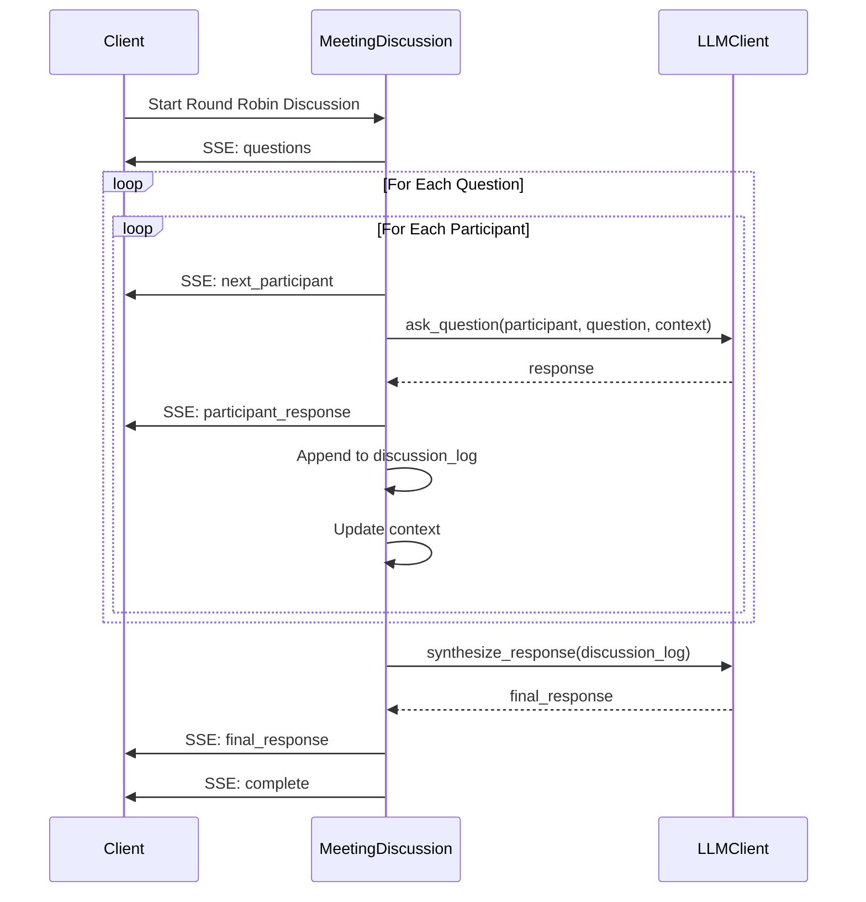
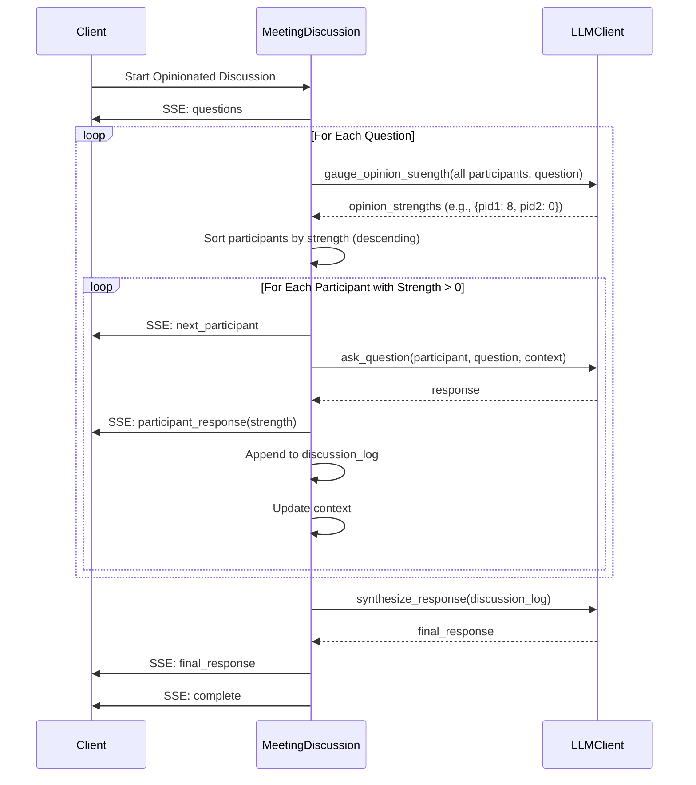

# roundtable-ai

`roundtable-ai` is a multi-agent system designed to orchestrate discussions among AI participants. It features a high-performance FastAPI backend and a modern React frontend that facilitate real-time chat and collaboration between participants.

## Main Entities
- **Participant**: Represents an individual user or AI agent involved in discussions.
- **Group**: A collection of participants grouped together for collaborative sessions.
- **Meeting**: A session where participants discuss and collaborate.
- **Chat**: A core real-time messaging system enabling live streaming of discussions. Chat functionality integrates with a Language Learning Model (LLM) to generate discussion questions and assist in conversation flow.

## Discussion Strategies

This section explains the two discussion strategies implemented in the MeetingDiscussion class: `Round Robin` and `Opinionated`. Each strategy dictates how participants engage in a virtual meeting discussion, facilitated by an LLM client. The strategies are designed to handle multiple participants, questions, and responses, with results streamed as Server-Sent Events (SSE).

### Round Robin Strategy

**Overview**
The Round Robin strategy ensures every participant gets an equal opportunity to respond to each question in a predefined order. The discussion proceeds sequentially through all questions, with each participant answering one question at a time before moving to the next. Responses are collected in a discussion log, and context from previous answers is passed along to inform subsequent responses. Finally, a synthesized response is generated based on the entire discussion.

**Key Features** 
Every participant answers every question.
Order is fixed and cyclical.
Context accumulates as the discussion progresses.
Suitable for structured, inclusive discussions.

### Opinionated Strategy

**Overview**
The `Opinionated` strategy prioritizes participants based on the strength of their opinions for each question. Before answering, each participant's opinion strength (rated 1-10) is gauged by the LLM. Participants with stronger opinions (higher ratings) respond first, while those with no opinion (rating 0) are skipped. Context accumulates from stronger opinions to inform later responses, and a final synthesized response is generated.

**Key Features**
Participants are sorted by opinion strength (descending).
Only participants with opinions (strength > 0) respond.
Context builds from stronger opinions onward.
Ideal for debates or discussions where conviction matters.

## Technology Stack and Tools
- **Backend:** 
  - FastAPI  
  - Python 3.9+  
  - SQLite for persistent storage  
  - ChromaDB for chat context management  
  - Azure OpenAI for LLM integration
- **Frontend:** 
  - React with shadcn-ui components  
  - TypeScript  
  - Vite as the build tool  
  - TailwindCSS for styling

## Setup and Installation
1. **Backend Setup**:
    - Ensure you have Python 3.9+ installed.
    - Install dependencies: `pip install -r backend/requirements.txt`
    - Configure environment variables as needed (e.g., OpenAI API keys).
    - Start the server: `uvicorn backend.main:app --reload`
2. **Frontend Setup**:
    - Navigate to the frontend directory: `cd frontend/agent-swarm`
    - Install dependencies: `npm install`
    - Start the development server: `npm run dev`
  
## Development Guidelines and Future Enhancements
- Follow PEP 8 guidelines for Python and Prettier formatting for TypeScript code.
- Ensure proper logging and error handling throughout the application.
- Future plans include:
  - Persisting chat logs beyond in-memory storage.
  - Enhancing routing and navigation in the frontend.
  - Expanding the LLM integration for more dynamic interactions.

---

Feel free to contribute and raise issues or pull requests for any improvements.
